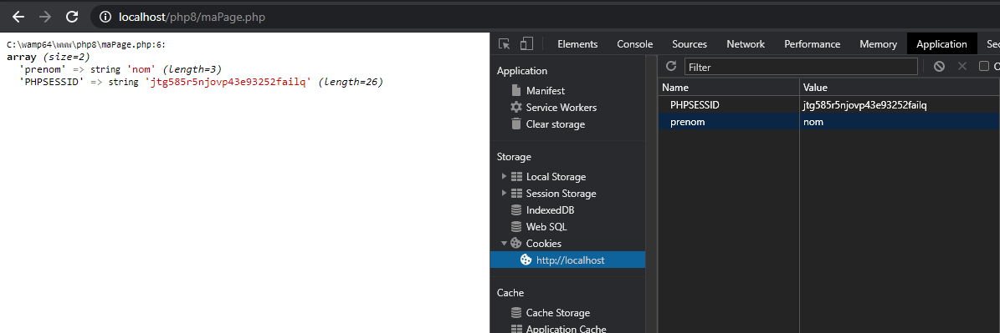

# Les Supers Globales

Qu'est ce qu'une super globale ? 
Tout simplement une donnée, une variable internet disponible quelque soit le contexte. 

Mais si j'en ai parlé ... bon OK 🙄 sous un autre nom, mais c'tait pour ne pas vous "spoil".

Re voici le tableau 


|    Array    |                                        Utilisation                                        |       Exemple        |
| :---------: | :---------------------------------------------------------------------------------------: | :------------------: |
| `$GLOBALS`  | Contient une référence sur chaque variable, les clés sont les noms des variables globales |   $GLOBAL['var1']    |
| `$_SERVER)` |        Les variables fournies par le serveur, ou liées à l'environnement du scirpt        | $_SERVER['PHP_SELF'] |
|   `$_GET`   |       Les variables fournies au script via la chaîne de requête URL en méthode GET        |     $_GET['id']      |
|  `$_POST`   |       Les variables fournies au script via la chaîne de requête URL en méthode POST       |    $_POST['nom']     |
|  `$_FILES`  |          Les variables fournies par le protocole HTTP suite à un téléchargement           | $_FILES['fichier1']  |
| `$_SESSION` |               Les variables enregistrées dans la session attachée au script               |  $_SESSION['var2']   |

# GET

Pour l'instant nous travaillons sur une seule et unique page "index.php". Mais vous ne vous êtes pas encore posée la question de comment pouvait-on trasmettre des informations à une autre page ? 

Cette variable (ou plus précisement, ce tableau associatif) permet justement de passer des données d'une page à une autre via l'URL.
Mais si l'URL comme dans une recherche google


Utilisation 

```html
<nav>
  <ol>
    <li><a href="maPage.php?nom=durand&prenom=loïc&age=29">Coucou c'est moi</a></li>
  </ol>
</nav>
```
```php
<?php
var_dump($_GET);
?>
```


# POST 

Ce tableau associatif permet également de passer des informations d'une page à l'autre sans avoir les données dans l'URL.

```html
<form action="maPage.php" method="post">
  <input name="person[0][first_name]" value="Loïc" />
  <input name="person[0][last_name]" value="Durand" />
  <input name="person[1][first_name]" value="Anthony" />
  <input name="person[1][last_name]" value="Gorski" />
  <input type="submit" value="subit" />
</form>
```

```php
<?php
var_dump($_POST);
?>
```


# SESSION

Ce tableau associatif permet de garder des informations d'un internaute tout au long de son parcours sur votre site web.

```php
<?php
// Toujours avant le html
session_start();

$_SESSION["nom"] = "Loïc";
?>

<html>
</html>
...
```

```php
<?php
var_dump($_SESSION_);
?>
```


# COOKIE

Ce tableau associatif permet de garder des informations d'un internaute tout au long de son parcours sur votre site web.

```php
<?php
// Toujours avant le html
setcookie("prenom", "Loïc", time() + 60 * 60 * 24 * 30 * 12);
?>

<html>
</html>
...
```

```php
<?php
var_dump($_COOKIE);
?>
```




FAILLE XSS 


> <script>alert("HACKER !!!!!!!") </script>


form avec $_SERVER['PHP_SELF']

en suite protéeger avec htmlspeccialschars($_SERVER['PHP_SELF'])


verifier toujours les input

fonction verifyInput

trim() qui enleve le superflu, espace supp 
stripslashes() enleve tous les anti slashes
htmlspecialchars()  " > &quot      & > &amp


enssuite securisation cote client avec required et type email 
faire des isset ou empty
pour emai; faire la fonction filter_var($var, FILTER_VALIDATE_EMAIL);

pour le tel (regex ou expression reguliaire)
preg_match("/^[0-9 ]*$", $var)


