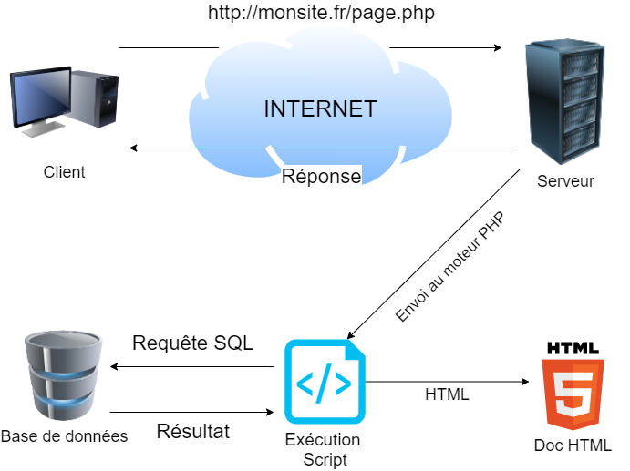

# Bienvenue sur le cours de PHP

## Mais finalement qu'est-ce que c'est ? 🤔

PHP, signifie **PHP: Hypertext Preprocessor**. Et oui, la première lettre est l'acronyme lui-même, appelé acronyme récursif. Historiquement, cette acronymie récursive était l'abréviation de **Personal Home Page**.

Mais entrons dans le vif du sujet, PHP est un **langage** de script HTML, exécuté coté serveur. Sa syntaxe est emprunté aux langages C et Java.

## Objectif et Motivation

J'ai créé tout d'abord ces documents dans le cadre des cours donnés au GRETA et également dans le but que ces fiches puissent servir et aider quelqu'un !

## Outils && Pré-requis

ATTENTION ... j'utilise pour ce cours :

| un éditeur de code            | [Visual Studio Code](https://code.visualstudio.com) |
| ----------------------------- | --------------------------------------------------- |
| un serveur web                | Apache                                              |
| Un interpréteur de script PHP | Zend Engine                                         |
| un serveur de base de donnée  | MySQL                                               |

Nous avons de la chance ... 💡, Vous pouvez utiliser le logiciel qui regroupe :

- un serveur web
- un interpréteur de script PHP
- un serveur de base de donnée 

Qui s'appelle [WAMP](https://www.wampserver.com) pour windows. Ou les déclinaisons pour MAC (MAMPP) et Linux (LAMP)

## Participer

Toutes les contributions sont les bienvenues et passent par des pulls-requests/issues pour garder une trace de la discussion. Veuillez les faire en français (ou anglais + traduction en français) pour pouvoir impliquer des apprenants francophones plus facilement.

## Sources

Un grand merci à :

- IUT D'Arles
  - M. Eric Remy
  - M. Gilles Gesquiere
  - M. Laurent Carmignac
  - M. Sébastien Thon
- [Anthony Gorski](https://github.com/GorskiAnthony)

# Maintenant que vous en savez plus, Commençons ! 😁

**[On Road To Pseudo-Code ...](./OnTheRoad/README.md)**
